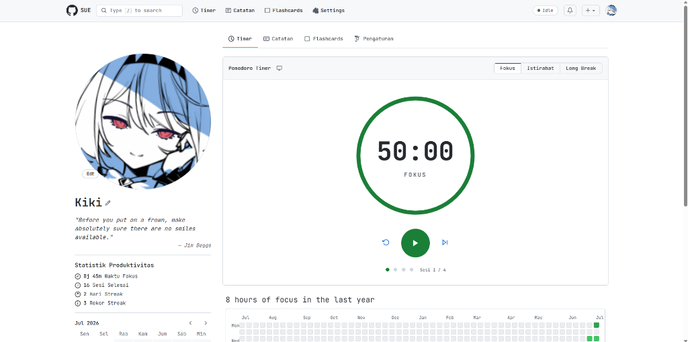
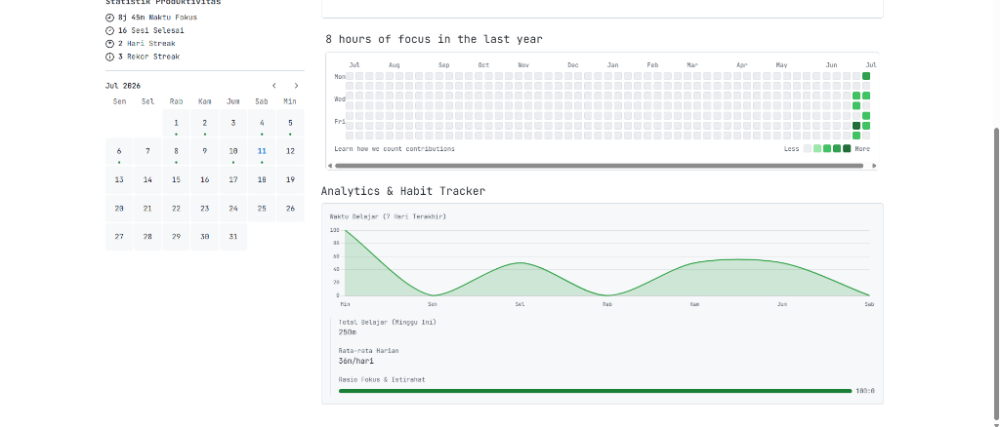

<h1 align="center">
  
  SUE (Show Up Everyday)
</h1>

<p align="center">
  <strong>An all-in-one offline productivity desktop application built with Electron.</strong>
</p>

<p align="center">
  
</p>

<p align="center">
  
</p>

<p align="center">
  
  
  
  
  
  
</p>

## ✨ About The Project

**SUE (Show Up Everyday)** is a minimalist, privacy-first desktop application designed to help you stay focused and organize your knowledge. It combines a Pomodoro timer, a Notion-style block editor, and a Spaced-Repetition flashcard system into one seamless, GitHub-styled dark mode interface.

All data is stored **100% locally** on your machine. No internet connection required (except for fetching daily motivational quotes).

## 🚀 Features

- ⏱️ **Focus Timer (Pomodoro)**
  - Customizable focus sessions.
  - Auto-start timer mode for seamless flow between Focus and Break sessions.
  - Interactive **Mini-Player mode** that stays out of your way while working.
  - "GitHub Contribution" style heatmap and **Chart.js Analytics** for tracking productivity trends.
- 📝 **Notion-Style Notes Editor**
  - Block-based text editing (text, checkboxes, image embeds).
  - Customizable header covers and tags.
- 🗂️ **Spaced Repetition Flashcards**
  - Organize your learning materials into custom Folders (Decks).
  - Tinder-like swipe mechanics (Left for "Forgot", Right for "Remembered") for studying.
- 🎨 **Aesthetics & Motivation (Awwwards-Style)**
  - GitHub-inspired UI elevated with **Glassmorphism** panels and an animated **Aurora Mesh Gradient** background.
  - Cyber-minimalist **dynamic text scrambling** loops powered by Anime.js.
  - Toggleable Dark and Light mode themes that seamlessly adapt the aurora background colors.
  - 🌐 **Bilingual Support (ID/EN)**: Seamlessly switch between Bahasa Indonesia and English interfaces.
  - **IndexedDB-powered profiles** supporting high-quality animated GIFs (up to 25MB).
  - Built-in library of 2000+ local offline motivational quotes that dynamically refresh.

## 🛠️ Installation & Setup

To run SUE locally on your machine:

1. **Clone the repository:**
   ```bash
   git clone https://github.com/vxyuuki/SUE-App.git
   cd SUE-App
   ```

2. **Install dependencies:**
   ```bash
   npm install
   ```

3. **Run in development mode:**
   ```bash
   npm run dev
   # (And in another terminal window)
   npm run desktop:dev
   ```

4. **Build the Desktop Application (.exe):**
   ```bash
   npm run desktop:build-pack
   ```
   *The compiled `.exe` file will be available in the `dist-electron/SUE-win32-x64` folder.*

## 📂 Tech Stack

- **Framework:** Electron & Vite
- **UI & Styling:** Vanilla HTML/CSS, GitHub Primer CSS
- **Animations:** Anime.js
- **Data Storage:** Local JSON Storage & IndexedDB (`userData` directory)

---
<div align="center">
  Made with ❤️ by <a href="https://github.com/vxyuuki">Kiki (vxyuuki)</a>
</div>
